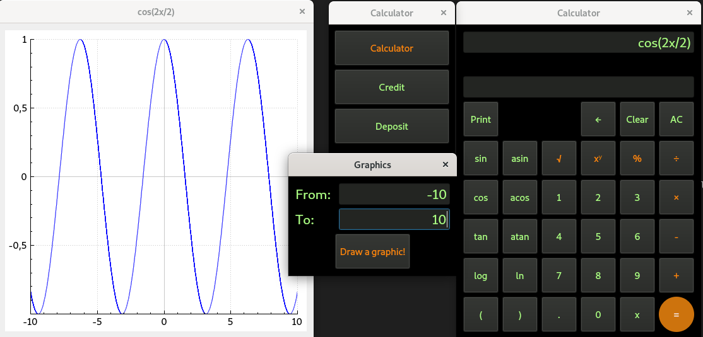
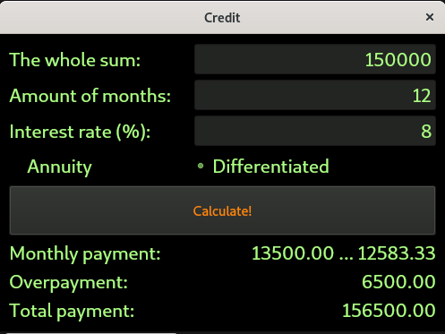

# SmartCalc v1.0

## Contents

0. [Introduction](#introduction)
1. [Basic calculator](#basic-calculator)
2. [Credit calculator](#credit-calculator)
3. [Deposit calculator](#deposit-calculator)

## Introduction

This is a program with a Qt-based interface which contains a regular calculator, a credit calculator and a deposit one.

## Basic calculator

The regular calculator is an extended version of the usual calculator (which can be found in the standard applications of each operating system) in the C programming language using structured programming. The regular calculator allows you to calculate arbitrary bracketed arithmetic expressions in infix notation, including the expressions with an x variable, which will be substituted with an additionally entered number.

It can also plot a graphic of a specific function. To do that you should enter the function in the calculator and press the "**Print**" button.

## Credit calculator

The credit calculator shows you monthly payment, overpayment on the credit and total payment.
- Input: total credit amount, term, interest rate, type (annuity, differentiated)
- Output: monthly payment, overpayment on credit, total payment

## Deposit calculator

The deposit calculator counts accrued interest, tax amount and the deposit amount by the end of the term.
- Input: deposit amount, deposit term, interest rate, tax rate, periodicity of payments, capitalization of interest, replenishments list, partial withdrawals list
- Output: accrued interest, tax amount, deposit amount by the end of the term

